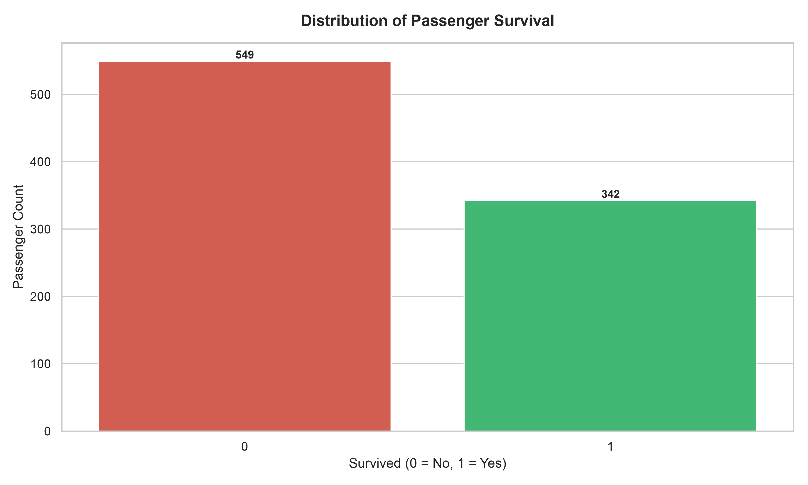
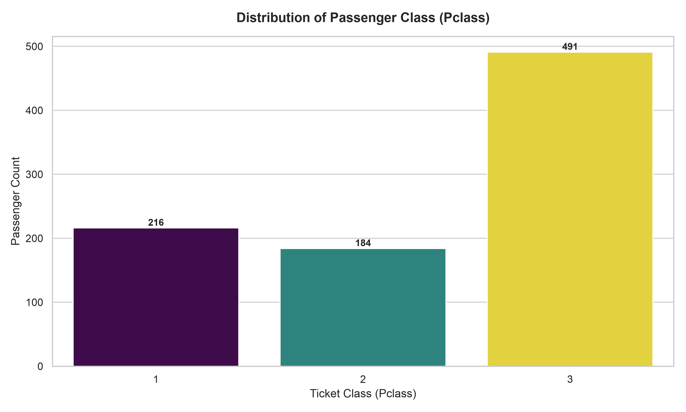
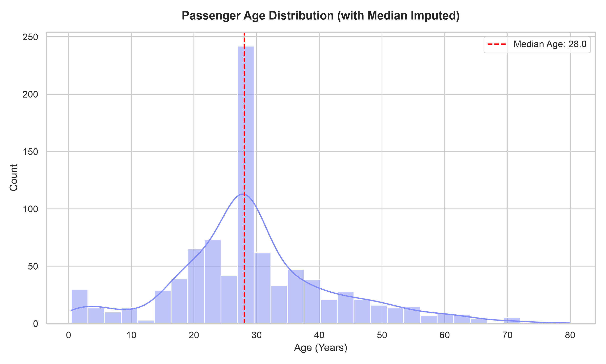
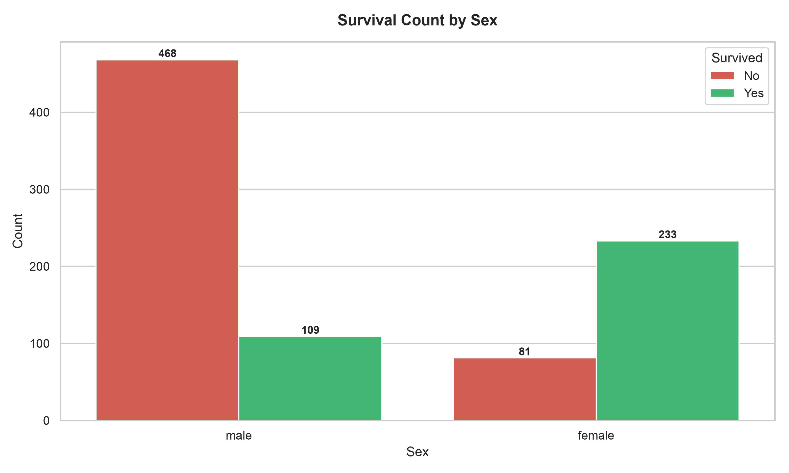
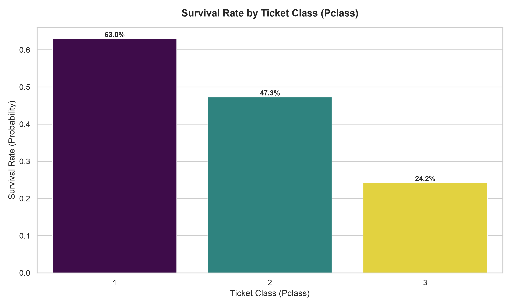
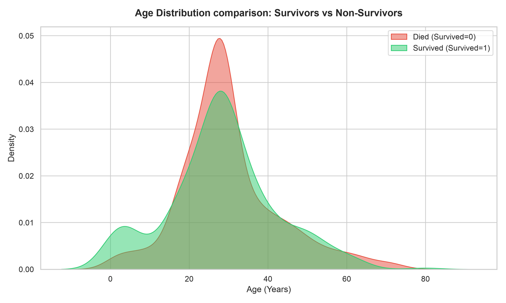
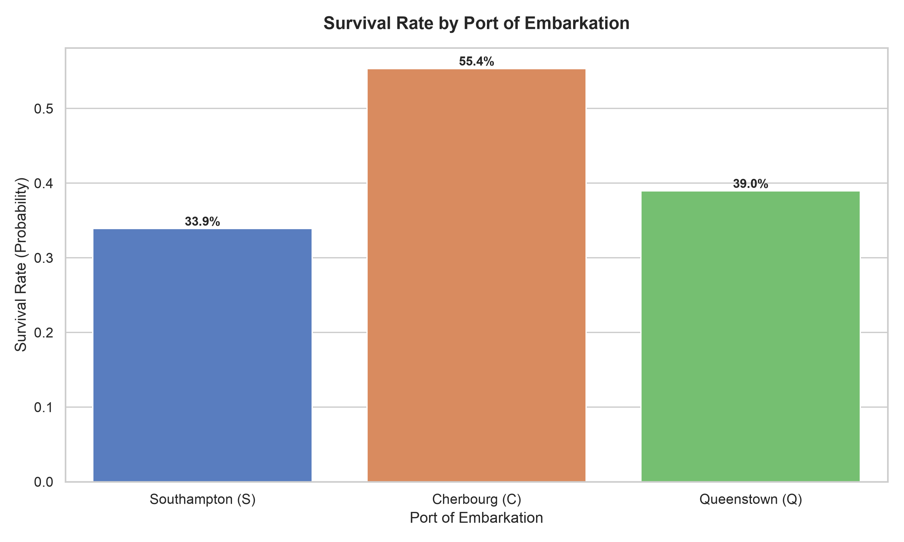

# Titanic Dataset Exploratory Data Analysis (EDA)

This report presents a complete Exploratory Data Analysis (EDA) on the Titanic dataset, detailing its structure, handling missing values, visualizing univariate distributions, exploring bivariate relationships with survival, and concluding with key insights.

---

## Task 1: Data Loading and Initial Inspection

First, we load the dataset using `pandas` and inspect its shape, column types, basic statistics, and missing values.

### Code Snippet: Loading and Inspection
```python
import pandas as pd

# Load dataset
df = pd.read_csv('titanic.csv')

# First 5 rows
print(df.head())

# Information on data types
df.info()

# Descriptive statistics
print(df.describe())

# Missing values count
print(df.isnull().sum())
```

### Initial Inspection Results
* **Dataset Shape**: 891 rows and 12 columns.
* **First 5 Rows**:
  | PassengerId | Survived | Pclass | Name | Sex | Age | SibSp | Parch | Ticket | Fare | Cabin | Embarked |
  | :--- | :--- | :--- | :--- | :--- | :--- | :--- | :--- | :--- | :--- | :--- | :--- |
  | 1 | 0 | 3 | Braund, Mr. Owen Harris | male | 22.0 | 1 | 0 | A/5 21171 | 7.2500 | NaN | S |
  | 2 | 1 | 1 | Cumings, Mrs. John Bradley (Florence Briggs Thayer) | female | 38.0 | 1 | 0 | PC 17599 | 71.2833 | C85 | C |
  | 3 | 1 | 3 | Heikkinen, Miss. Laina | female | 26.0 | 0 | 0 | STON/O2. 3101282 | 7.9250 | NaN | S |
  | 4 | 1 | 1 | Futrelle, Mrs. Jacques Heath (Lily May Peel) | female | 35.0 | 1 | 0 | 113803 | 53.1000 | C123 | S |
  | 5 | 0 | 3 | Allen, Mr. William Henry | male | 35.0 | 0 | 0 | 373450 | 8.0500 | NaN | S |

* **Data Types**:
  * **Numerical (Integer/Float)**: `PassengerId` (int64), `Survived` (int64), `Pclass` (int64), `Age` (float64), `SibSp` (int64), `Parch` (int64), `Fare` (float64)
  * **Categorical / Text**: `Name` (object/str), `Sex` (object/str), `Ticket` (object/str), `Cabin` (object/str), `Embarked` (object/str)

* **Missing Values Found**:
  * `Age`: 177 missing values
  * `Cabin`: 687 missing values
  * `Embarked`: 2 missing values
  * All other columns have 0 missing values.

---

## Task 2: Handling Missing Values

We addressed the missing values in `Cabin`, `Embarked`, and `Age` using appropriate strategies:

### 1. Cabin Column
* **Missing Value Percentage**: **77.10%** (687 out of 891 values are null).
* **Decision**: **Drop the Cabin column.**
* **Justification**: Since more than three-quarters of the `Cabin` data is missing, any imputation method (like filling with the mode or trying to predict cabin numbers) would introduce substantial noise, bias, and artificial patterns into the dataset. While having a valid cabin number might correlate with survival (socioeconomic status), the extreme scarcity of the data makes it unusable for general statistical analysis. Thus, it is dropped from the active EDA.

### 2. Embarked Column
* **Most Frequent Port (Mode)**: `'S'` (Southampton) with 644 occurrences.
* **Action**: Imputed the 2 missing values with `'S'`.

### 3. Age Column
* **Median Age**: **28.0 years**.
* **Action**: Imputed the 177 missing values with the median age of `28.0`. This prevents skewing the distribution compared to using the mean, which is more sensitive to outliers.

---

## Task 3: Univariate Analysis

Univariate analysis examines the distribution of single variables individually.

### 1. Survival Rate
* **Overall Survival Rate**: **38.38%** (342 out of 891 passengers survived).
* **Survival Distribution**: 549 passengers did not survive, while 342 survived.



### 2. Passenger Class (Pclass)
* **Passenger Counts by Class**:
  * **Class 3 (Third Class)**: 491 passengers
  * **Class 1 (First Class)**: 216 passengers
  * **Class 2 (Second Class)**: 184 passengers
* **Class with Most Passengers**: **Class 3** (Third Class) had the highest passenger density.



### 3. Age Distribution
* The passenger age distribution ranges from infants under 1 year old to elderly passengers up to 80 years old.
* Imputing the median age of 28.0 created a minor spike around the 28-year mark, but overall the distribution remains normal/right-skewed, peaking in the young adult range (20–35 years).



---

## Task 4: Bivariate and Multivariate Analysis

Here we examine the relationships between passenger features and their survival status.

### 1. Survival by Sex
* **Crosstabulation (Survival Counts by Sex)**:
  | Sex | Died (0) | Survived (1) | Total | Survival Rate |
  | :--- | :---: | :---: | :---: | :---: |
  | **Female** | 81 | 233 | 314 | **74.20%** |
  | **Male** | 468 | 109 | 577 | **18.89%** |



* **Question**: Which gender had a significantly higher survival rate?
* **Answer**: **Females** had a dramatically higher survival rate of **74.20%**, compared to only **18.89%** for males. This reflects the historical "women and children first" evacuation policy.

---

### 2. Survival by Class (Pclass)
* **Survival Rates per Class**:
  * **Class 1**: **62.96%** (136 out of 216 survived)
  * **Class 2**: **47.28%** (87 out of 184 survived)
  * **Class 3**: **24.24%** (119 out of 491 survived)



* **Question**: Is there a clear correlation between ticket class and survival probability?
* **Answer**: **Yes, there is a strong positive correlation between higher ticket classes and survival rates.** First-class passengers were more than twice as likely to survive compared to third-class passengers (62.96% vs 24.24%). This indicates that socioeconomic status and cabin proximity to the boat deck played a major role in survival.

---

### 3. Survival by Age
* **Comparison of Age Distributions**:



* **Observation**: What does the plot suggest about the survival chances of children and the elderly?
* **Answer**: The density plot highlights a distinct spike in survival for **children under 10 years old**, indicating that children were prioritized for lifeboats. Conversely, the survival density for young adults (ages 18–35) is much lower (larger proportion of deaths). For the elderly (ages 60+), survival rates were generally low, reflecting their vulnerability and lack of priority during the evacuation.

---

### 4. Survival by Port of Embarkation (Embarked)
* **Survival Rates per Port**:
  * **Cherbourg (C)**: **55.36%** survival rate
  * **Queenstown (Q)**: **38.96%** survival rate
  * **Southampton (S)**: **33.90%** survival rate



* Passengers embarking at Cherbourg (C) had a noticeably higher survival rate (55.36%). Further multivariate inspection shows that Cherbourg had a higher proportion of First-Class passengers, which explains the higher survival rate.

---

## Task 5: Conclusion and Insights

Based on this Exploratory Data Analysis, the most significant factors affecting survival on the Titanic were passenger gender, ticket class, and age. 

1. **Sex (Gender)** was the single strongest predictor of survival; females had a **74.20%** survival rate, while males had only an **18.89%** survival rate. 
2. **Passenger Class (Pclass)** acted as a major socioeconomic indicator; First-Class passengers had a **62.96%** survival rate, while Third-Class passengers had just **24.24%**. 
3. **Age** was a crucial secondary factor, where children under 10 had a much higher likelihood of survival due to rescue priority, whereas young adults and the elderly had significantly lower survival probabilities.
